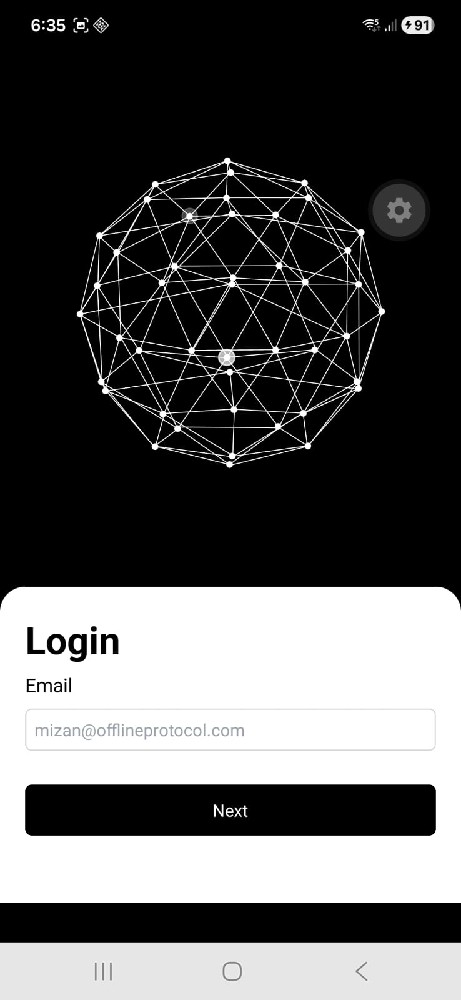
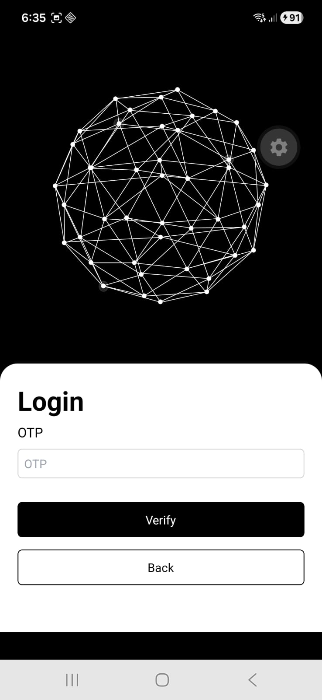
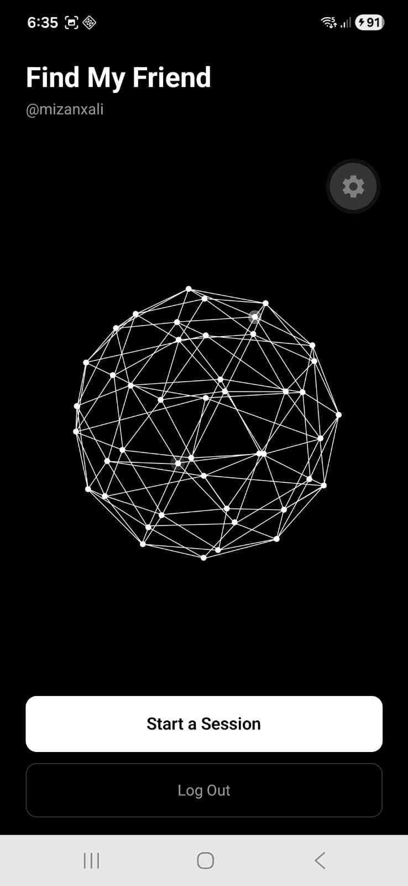
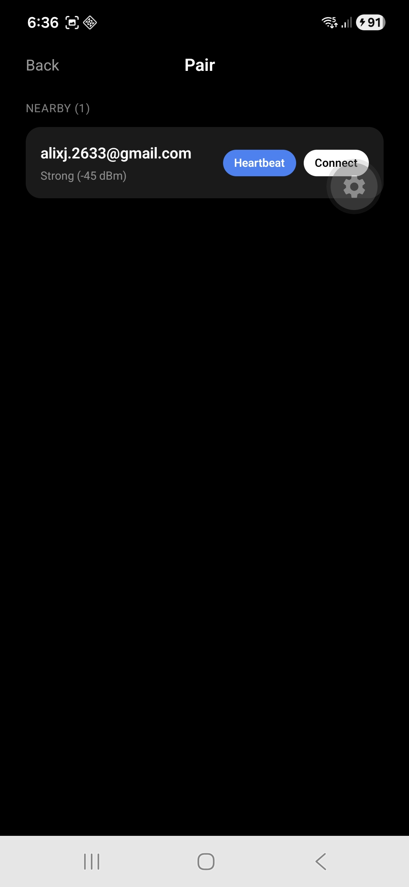
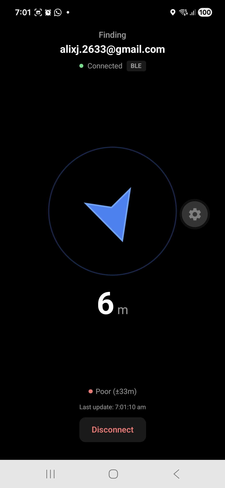
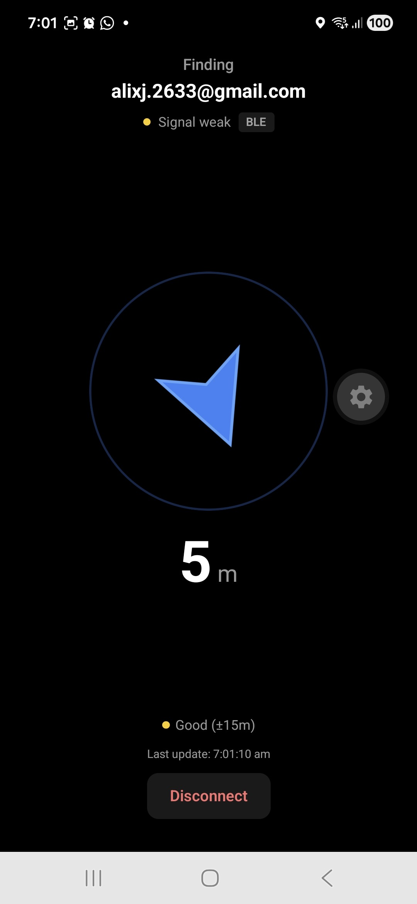

# Find My Friend

A React Native app that lets two people find each other **without internet**. It exchanges GPS coordinates over Bluetooth (BLE) and WiFi Direct, then shows a live compass arrow pointing towards your friend along with the distance between you.

Unlike Apple's Find My or Google's Find My Device, this app works **fully offline and peer-to-peer** - no cloud servers, no internet relay, no third-party tracking.

Use cases: Any place where you want to find your friend without internet availability. Concerts and festivals, war zones, regions affected by natural disasters, etc.

## How It Works

1. **Login** - Authenticate with your email via OTP through [Offline Protocol](https://offlineprotocol.com) identity.
2. **Start a Session** - Tap "Start a Session" to begin scanning for nearby devices over BLE.
3. **Pair** - A live list of nearby devices appears with signal strength (RSSI). Tap "Connect" on a friend's device to send a pairing request. They accept, and you're linked.
4. **Find** - Once paired, both devices continuously exchange GPS coordinates over BLE/WiFi Direct. A compass arrow rotates in real-time to point toward your friend, and the distance updates every 2 seconds. An accuracy indicator and last-update timestamp keep you informed about data quality.

### Under the Hood

- **GPS** provides each device's coordinates - works without internet.
- **BLE / WiFi Direct** (via Offline Protocol Mesh SDK) handles peer discovery, pairing, and message transport - also fully offline.
- **Haversine formula** computes the distance between the two GPS positions.
- **Bearing calculation** determines the compass direction from you to your friend.
- **Device heading** (compass) is subtracted from the bearing to produce the arrow rotation - so the arrow always points toward your friend regardless of which way you're facing.

## Tech Stack

**Framework**: React Native (Expo)  
**Mesh Networking**: [`@offline-protocol/mesh-sdk`](https://offlineprotocol.com) - BLE/WiFi Direct peer discovery and messaging
**Identity**: [`@offline-protocol/id-react-native`](https://offlineprotocol.com) - OfflineID for peer authentication  
**State Management**: Zustand  
**Location & Compass**: `expo-location` (GPS reads + `watchHeadingAsync` for compass heading)

## Project Structure

```
src/
├── app/                        # Expo Router screens
│   ├── _layout.tsx             # Root layout with auth guard
│   ├── login.tsx               # Login screen
│   └── (app)/
│       ├── index.tsx           # Home screen
│       └── session.tsx         # Session screen (pair → find lifecycle)
├── components/
│   ├── session/
│   │   ├── PairPhase.tsx       # Pair phase UI
│   │   └── FindPhase.tsx       # Find phase UI (compass, distance)
│   ├── find/
│   │   ├── CompassArrow.tsx    # Animated directional arrow
│   │   ├── DistanceLabel.tsx   # Auto-scaling distance display (m/km)
│   │   └── AccuracyRing.tsx    # GPS accuracy visualization
│   ├── pair/
│   │   ├── NeighborList.tsx    # Nearby devices list sorted by signal
│   │   └── IncomingRequestCard.tsx
│   └── login/
│       └── LoginForm.tsx       # Email + OTP login form
├── hooks/
│   ├── useLocation.ts          # GPS polling wrapper
│   ├── useMeshPeer.ts          # Mesh SDK lifecycle and messaging
│   ├── useCompass.ts           # Device heading
│   ├── useBearing.ts           # Haversine + bearing math
├── stores/
│   └── sessionStore.ts         # Zustand store
└── utils/
    └── geo.ts                  # Haversine, bearing, unit conversion
```

## Screenshots

<p align="center">
  
  
  
</p>
<p align="center">
  
  
  
</p>
